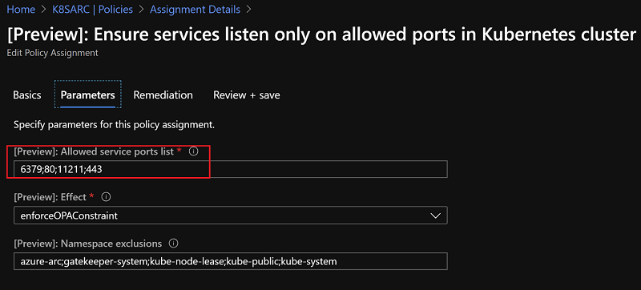

## Arc for Kubernetes Demo Scenarios

Arc for Kubernetes contains below demos
- GitOps demo, by leveraging github and Arc for Kubernetes shows how to deploy your packages to AKS cluster.
- Kubernetes cluster monitoring demo, shows how to monitor Kubernetes cluster from on-premises or from other cloud provider.
- Azure Kubernetes policy demo, shows how to apply policy controls on Arc managed Kubernetes cluster.

## GitOps Demo

1. Click this [URL](https://ms.portal.azure.com/?feature.azureArc=true&Microsoft_Azure_ContainerService=flight4&feature.enablearck8smonitoring=true&feature.azureAroV4=true#@microsoft.onmicrosoft.com/resource/subscriptions/513df66c-64b0-4c0b-a13a-7f37bb384aff/resourceGroups/AzureArc/providers/Microsoft.Kubernetes/connectedClusters/K8SARC/overview), it is an "Arc for Kubernetes" environment shows in Azure portal, you can click each blade and shows how it looks like.

2. From browser, open URL http://vote-arc.k8s.devsecops.ink, this is an application deployed into Arc managed Kubernetes cluster, we will demo how to apply GitOps on this application, currently the application has version v1, highlight the version to your customer at this moment.

3. From browser, open https://github.com/devopsonazure/vote-arc/blob/master/manifests/deployment.yml this is the source project hosted in github, you should be able to edit this file with your own GitHub account. Explain to your customer it is already deployed to Arc managed Kubernetes cluster, you are going to simulate the a deployment by modifying the deployment source, step 1 is clicking the highlighted button, step 2 modifying image from huangyingting/azre-vote-front-arc:v1 to huangyingting/azure-vote-front-arc:v2, or v3, v4, v5.

4. Click "Commit changes" button to commit the change.

5. It should take 1 – 2 minutes to apply the new change, right now, you could go to webpage opened in step 1, then go to Configurations->Add configuration, explain to your customer how to deploy an application from "Arc for Kubernetes", a sample configuration is provided in below screen shot, basically it is related with writing kubernete yaml files or creating helm deployment files, in this demo, we simply use a Kubernetes yaml files, all those yaml files are in https://github.com/devopsonazure/vote-arc/tree/master/manifests, so just explain to your customer how it looks like.

6. Open URL http://vote-arc.k8s.devsecops.ink, refresh it, now it should change to corresponding version.

## Arc Enabled Cluster Monitoring Demo

Click this [URL](https://ms.portal.azure.com/?feature.azureArc=true&Microsoft_Azure_ContainerService=flight4&feature.enablearck8smonitoring=true&feature.azureAroV4=true#@microsoft.onmicrosoft.com/resource/subscriptions/513df66c-64b0-4c0b-a13a-7f37bb384aff/resourceGroups/AzureArc/providers/Microsoft.Kubernetes/connectedClusters/K8SARC/overview), from opened Azure portal, go to Monitoring->Insights(preview), now you can demo how Arc for Kubernetes monitoring works, click Cluster, Health (Preview), Nodes, Controller and Containers, explain how monitoring looks like in Arc for Kubernetes.
The detailed reference document can be found at [Enable monitoring of Azure Arc enabled Kubernetes cluster](https://docs.microsoft.com/en-us/azure/azure-arc/kubernetes/deploy-azure-monitor-for-containers)

## Arc Enabled Cluster Policy Demo

1. Arc for Kubernetes leverages [gatekeeper](https://github.com/open-policy-agent/gatekeeper) to meet governance and legal requirements, the policy definition is integrated into Azure policy itself, to demo how it works, click this [URL](https://ms.portal.azure.com/?feature.azureArc=true&Microsoft_Azure_ContainerService=flight4&feature.enablearck8smonitoring=true&feature.azureAroV4=true#@microsoft.onmicrosoft.com/resource/subscriptions/513df66c-64b0-4c0b-a13a-7f37bb384aff/resourceGroups/AzureArc/providers/Microsoft.Kubernetes/connectedClusters/K8SARC/overview), then go to Policies, 

2. Click "[Preview]: Ensure services listen only on allowed ports in Kubernetes cluster" policy, then "Edit assignment", from opened page, go to "Parameters", explain to customer current policy assignment only allows port 6379, 80, 11211 and 443, if a deployment tries to create other ports like port 8080, then it will get denied.

3. Close "Assignment Details", then go to "View definition", it will list policy definition in ARM template, go to constraintTemplate, open the URL, it will reveal how the real policy looks like, it is an OPA constraint template.

4. To show how constraint template works, 
- Visit https://shell.azure.com, choose Bash
- From cloud shell, run `git clone https://github.com/devopsonazure/devopsonazure`
- Type `cd devopsonazure`
- Run `kubectl --kubeconfig arcpolicy apply -f https://raw.githubusercontent.com/devopsonazure/vote-arc/master/policy/service-port-not-allowed.yaml -n policy`, this command basically tries to deploy a service at 8080, because our policy doesn’t allow port 8080, so it will end with below error

- Open https://raw.githubusercontent.com/devopsonazure/vote-arc/master/policy/service-port-not-allowed.yaml to explain the service tries to bind to port 8080. 
