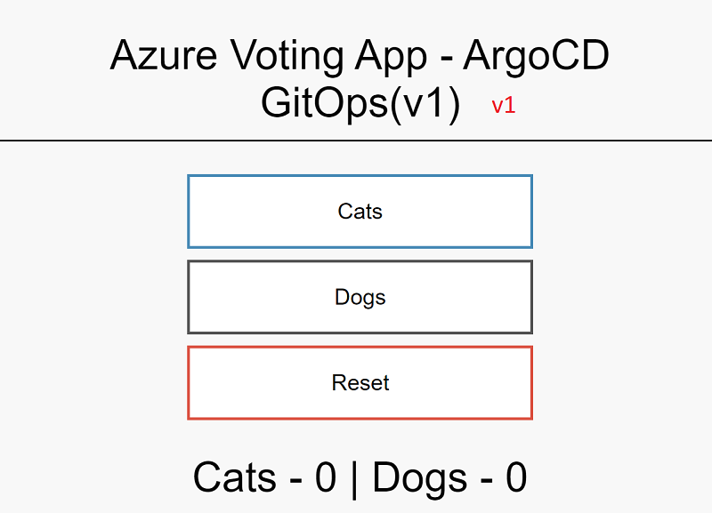
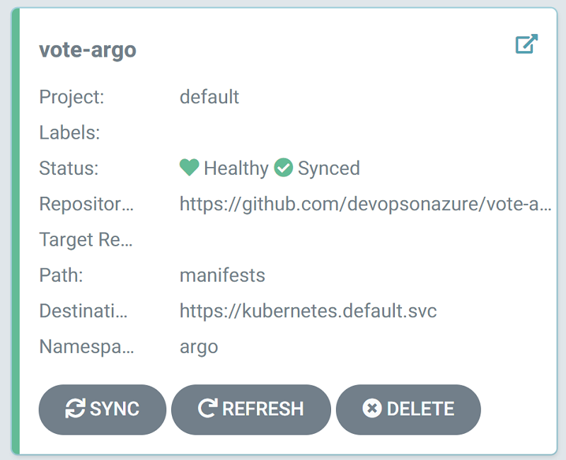
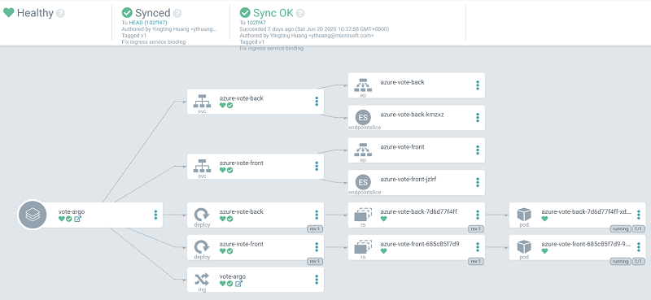
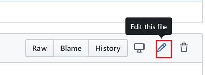
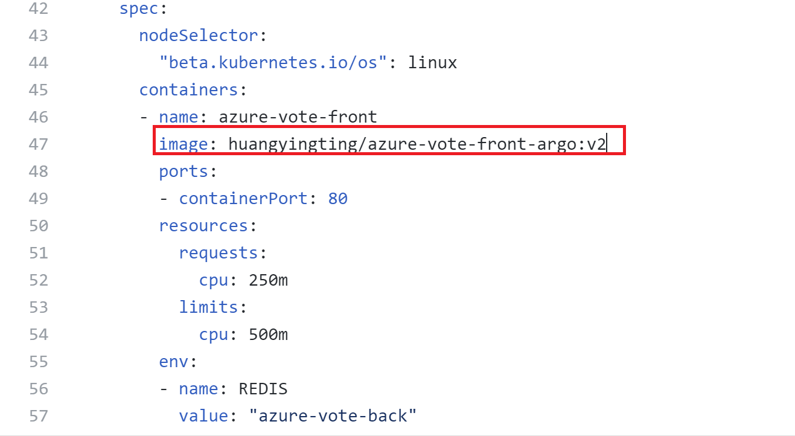
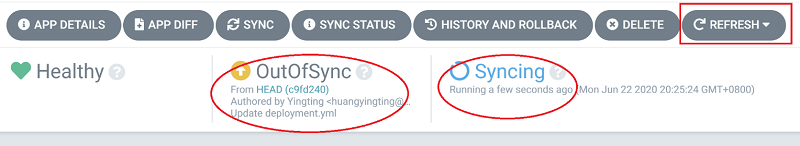
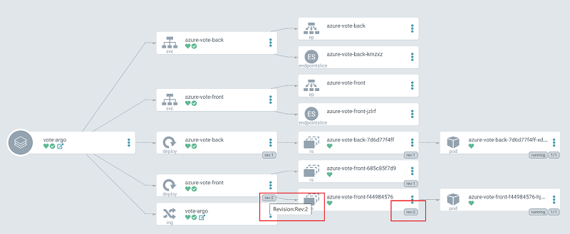
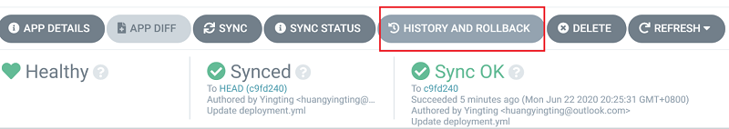
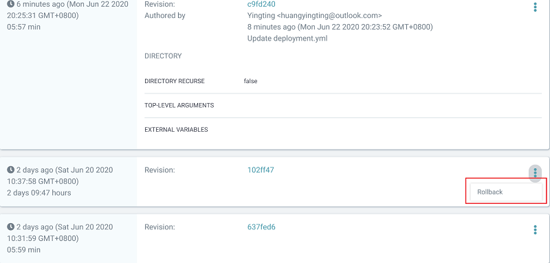

## Argo CD Demo Scenarios
Argo CD is a declarative, GitOps continuous delivery tool for Kubernetes. In this demo, we leverage ArgoCD to deploy application into Kubernetes cluster, this demo includes
- Basic ArgoCD GitOps pipeline
- ArgoCD UI

## Demo Steps
To use this demo, follow below steps
1. Open URL http://vote-argo.k8s.devsecops.ink/, show to your customer currently the application is at version 1.

2. Open URL https://argocd.k8s.devsecops.ink/, login with 
Username: admin
Password: P@ssw0rd
3. Now, click below tile

This is a completed deployment view for existing application in Kubernetes, includes service, deploy, replicaset, pod and ingress, currently it shows the argo-vote v1 version.

4. Go to URL https://github.com/devopsonazure/vote-argo/blob/master/manifests/deployment.yml, login with your github credentials, then click `Edit` button

5. Change this line from `huangyingting/azure-vote-front-argo:v1` to `huangyingting/azure-vote-front-argo:v2`, then commit the change

6. Go back to webpage opened at step 3, click `Refresh` button a few of times, the status will change to OutOfSync, and eventually it will be in Syncing state

7. Once syncing is completed, you will see azure-vote-front changed to revision: Rev 2

8. If you want to rollback the deployment, you can click "HISTORY AND ROLLBACK" button 

9. ArgoCD keeps 5 recent deployments, you can rollback to any of them from the 5 deployments, just click `Rollback` button from the popup menu.

