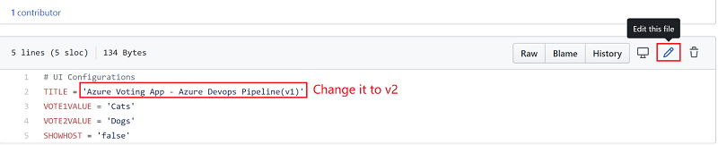
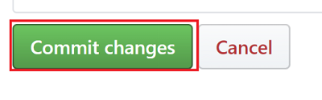
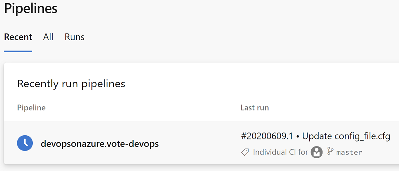
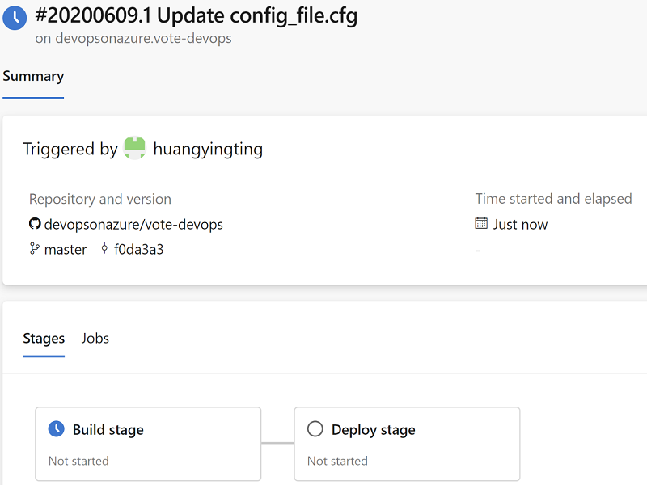
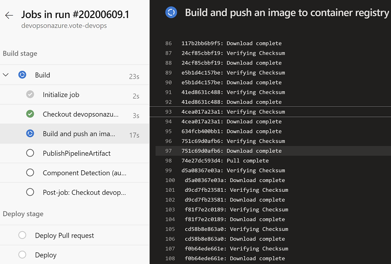
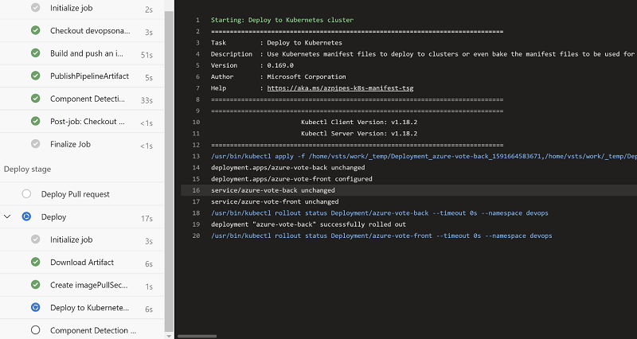
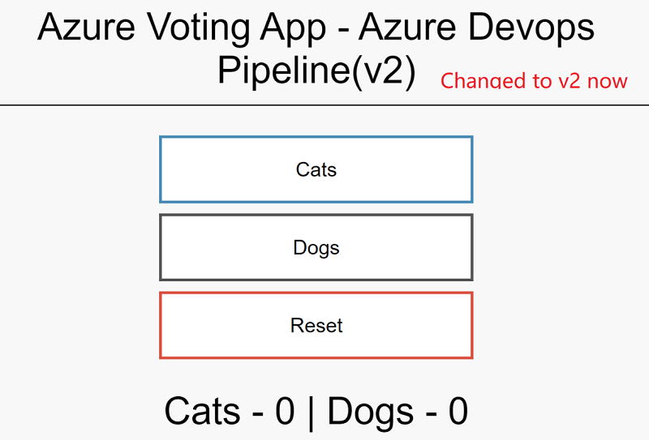

## Azure DevOps Demo Scenarios
Azure devops demo will use
- Github repository to store the source code
- Azure devops to implement a "build & deployment" pipeline, a docker image will be created from demo application, then it gets pushed to azure container registry, eventually gets deployed to AKS

To use this demo, follow below steps to open 3 webpages,
1. Open [webpage 1](http://vote-devops.k8s.devsecops.ink/), this is sample vote demo application which is deployed to AKS already, currently, its version is `Azure Voting App - Azure Devops Pipeline(v1)`, highlight application version to your customer, lately the version will get changed to `Azure Voting App - Azure Devops Pipeline(v2)`
2. Open [webpage 2](https://github.com/devopsonazure/vote-devops/blob/master/azure-vote/config_file.cfg), this is sample application configuration file, we are going to change the configuration, rebuild and deploy it to AKS.
3. Open [webpage 3](https://dev.azure.com/pipelineonazure/vote-devops/_build), this is Azure devops pipeline, we use this page to show how build & deploy works here.

## Demo Steps
1. Go to webpage 2, click edit icon and change TITLE from `Azure Voting App - Azure Devops Pipeline(v1)` to `Azure Voting App - Azure Devops Pipeline(v2)`

2. Click `Commit changes` button to commit the change

3. Switch to webpage 3, refresh the page (might be multiple times), it will display Azure devops pipeline is started eventually.

4. This is a multi-stages pipeline, it contains `Build stage` and `Deploy stage`

5. Click build and deploy stage, show it to your customer how  build & deploy stages look like

6. Once build & deploy are done (everything is green), switch to webpage 1, refresh the page, it should change the title to 'Azure Voting App - Azure Devops Pipeline(v2)'

7. If your customer is interested in how 'Azure Devops Pipeline' looks like, you could open this [link](https://github.com/devopsonazure/vote-devops/blob/master/azure-pipelines.yml) to show pipeline definitions.

